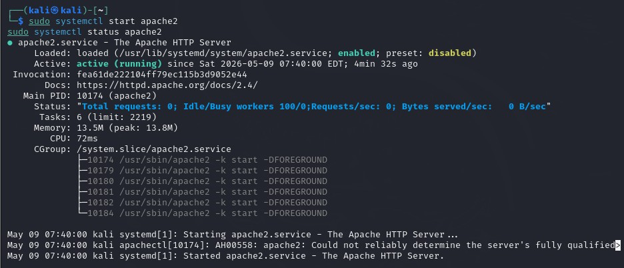
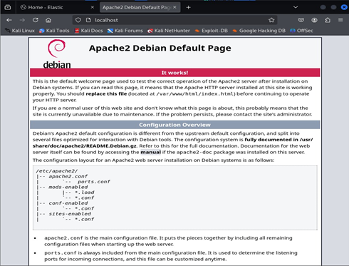

# Web Security Monitoring with ELK Stack

## Overview

This project is a hands-on SOC lab focused on detecting web attacks using Apache logs and the ELK Stack.

The lab simulates suspicious HTTP activity against a local Apache web server. Logs are collected with Filebeat, stored in Elasticsearch, and investigated in Kibana using KQL queries.

## Lab Architecture

Attacker / Test Machine
→ Apache Web Server
→ Apache access.log / error.log
→ Filebeat
→ Elasticsearch
→ Kibana
→ SOC Analyst Investigation
## Screenshots

### Apache Service Running

### Apache Default Page

### Reconnaissance Detection

## Tools Used

* Kali Linux
* Apache Web Server
* PHP
* Filebeat
* Elasticsearch
* Kibana
* Docker
* KQL
* curl
* Nikto

## Attack Scenarios Simulated

### 1. Reconnaissance Scanning

Nikto and manual requests were used to simulate web reconnaissance. The goal was to identify suspicious requests to hidden or sensitive paths.

Examples of suspicious paths:

* `/admin`
* `/.env`
* `/.git/config`
* `/backup.zip`
* `/phpmyadmin`

### 2. Brute-Force Login Attempts

Repeated login requests were sent to the `login.php` endpoint using different password values. This simulates automated password guessing against a web login form.

### 3. Injection and Path Traversal Attempts

The lab includes detection of suspicious payloads such as:

* SQL injection patterns
* `UNION SELECT` attempts
* XSS payloads
* Path traversal attempts
* Requests targeting `/etc/passwd`

## Detection Logic

Suspicious activity was identified by looking for:

* High number of requests from one source
* Many 404 responses in a short time
* Requests to hidden files
* SQL keywords in URL parameters
* XSS script tags
* Path traversal sequences
* Repeated login attempts

## Example KQL Queries

### Detect SQL Injection

`message: "*UNION*"`

### Detect Hidden File Probing

`message: "*.env*"`

### Detect Path Traversal

`message: "*../*"`

### Detect XSS Payloads

`message: "*<script>*"`

### Detect Login Attempts

`message: "*login.php*" and message: "*admin*"`

## Investigation Questions

During the investigation, the following SOC questions were answered:

* When did the attack start and end?
* What source IP generated the suspicious traffic?
* Which paths or parameters were targeted?
* How many requests were sent?
* Did any suspicious request return HTTP 200 OK?
* Which activity should be escalated?

## Defensive Analysis

The lab also discusses defensive controls such as:

* Web Application Firewall rules
* Rate limiting
* Fail2Ban
* Detection tuning
* Blocking suspicious request patterns

## Key Takeaways

This project helped me practice:

* Web log analysis
* SIEM investigation workflow
* KQL query writing
* Web attack detection
* Basic SOC triage
* Incident timeline building
* Defensive thinking for web security monitoring
